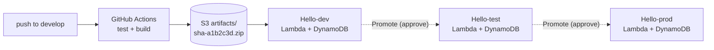

# hello-aws

A hello-world HTTP service running on the **AWS Always Free** tier, with a
**dev → test → prod** promotion pipeline built on GitHub Actions.

The application is deliberately trivial. The point of this repo is the delivery
pipeline around it: three isolated environments, one immutable build artifact
promoted through all of them, and a bill of **$0/month with no expiry date**.

```
GET /         -> {"message":"Hello, world!","env":"dev","visits":42,...}
GET /health   -> {"status":"ok","env":"dev","release":"artifacts/sha-a1b2c3d.zip"}
```

**Live** (`ap-south-1`), all three running the same artifact:

| Env | URL |
|---|---|
| dev | https://s7y2t6r7od3ggsjg26llv7ebbu0gufuk.lambda-url.ap-south-1.on.aws/ |
| test | https://h7gxtel2vxime4ka4po255su5i0bbxjq.lambda-url.ap-south-1.on.aws/ |
| prod | https://frcamovshkjqfj5u3cyismw3440mlyty.lambda-url.ap-south-1.on.aws/ |

---

## Why this architecture

AWS changed its free tier in July 2025: new accounts get **credits that expire
in 6 months** instead of the old 12-month free tier. So anything built on EC2 or
RDS eventually starts costing money.

These services have an **Always Free** allowance with *no expiry*:

| Layer | Service | Always Free allowance |
|---|---|---|
| Compute | Lambda + Function URL | 1M requests + 400,000 GB-sec/month |
| Database | DynamoDB on-demand | 25 GB storage + 200M requests/month |
| CDN | CloudFront *(optional)* | 1 TB out + 10M requests/month |
| Config | SSM Parameter Store (standard) | Free |
| Logs | CloudWatch Logs | 5 GB ingest/month |
| Artifacts | S3 | A few MB of zips — pennies |
| CI/CD | GitHub Actions + OIDC | Free |

Two deliberate choices worth knowing about:

- **Lambda Function URLs, not API Gateway.** API Gateway's 1M free requests
  expire after 12 months; Function URLs are free and give you HTTPS directly.
  Add CloudFront in front only when you want a custom domain.
- **ARM64 Lambda.** ~20% cheaper per GB-second, so the free 400,000 GB-sec
  stretches further.

---

## Architecture



One AWS account, three CloudFormation stacks. Environments are isolated by:

- **Name prefix** — `hello-dev`, `hello-test`, `hello-prod` for every resource.
- **Separate CDK bootstrap qualifiers** (`hdev`, `htest`, `hprod`). Each
  environment has its own set of CloudFormation deployment roles.
- **Per-environment IAM roles** trusted only by the matching GitHub Environment.
  The `sub` claim in the OIDC trust policy is
  `repo:<you>/hello-aws:environment:prod`, so a workflow running against `dev`
  cannot assume the prod role even if someone edits the workflow file.
- **Least privilege on artifacts** — only the `dev` role can write to the
  artifact bucket. `test` and `prod` can deploy existing artifacts, never create
  new ones.

Prod also differs where it matters: `RemovalPolicy.RETAIN` on the table,
point-in-time recovery on, 512 MB of memory, and 30-day log retention. Those
differences live in an `isProd` flag inside one shared stack — not in a forked
copy — so the environments cannot drift apart.

---

## The promotion model

**Build once, promote the same artifact.** This is the part that matters.

```
push to develop
   └─ test  ──▶ build  ──▶ s3://…/artifacts/sha-a1b2c3d.zip
                              └─▶ deploy Hello-dev          (automatic)
                                     │
                    ┌────────────────┘
                    ▼  Promote → test   (waits for your approval)
                 Hello-test                                  ← identical bytes
                    │
                    ▼  Promote → prod   (waits for your approval)
                 Hello-prod                                  ← identical bytes
```

Nothing is rebuilt between environments. If test rebuilt from source, you would
be testing a different binary than the one reaching production — dependency
versions drift, and "works in test, breaks in prod" becomes unexplainable.

The promote workflow does **not** accept an arbitrary artifact. It reads the
`ArtifactKey` CloudFormation output from the *upstream* stack, so you can only
promote something that is genuinely running in the previous environment. There
is no path from a laptop straight to prod.

**Rollback** is the same mechanism in reverse: every build ever made is still in
S3, so redeploying an older key takes about thirty seconds.

---

## Repository layout

```
src/index.mjs                  the Lambda handler (no runtime dependencies)
test/handler.test.mjs          node:test unit tests
scripts/local.mjs              run the handler on localhost, no AWS needed
scripts/bootstrap-aws.ps1      one-time AWS setup — idempotent
infra/                         AWS CDK app (TypeScript)
  bin/app.ts                   entry point; requires envName + artifactKey
  lib/app-stack.ts             Lambda + Function URL + DynamoDB + log group
.github/workflows/
  ci-cd.yml                    push to develop -> test -> build -> deploy dev
  deploy.yml                   reusable deployer (holds the approval gate)
  promote.yml                  dev -> test -> prod
```

The handler has **zero runtime dependencies** — AWS SDK v3 ships with the
Node.js 22 managed runtime, so the deployment zip is a few KB. The SDK packages
are `devDependencies` purely so the tests can run locally. The trade-off is that
you inherit whichever SDK version AWS ships; bundle it if you ever need to pin.

---

## Local development

**Node 22** — pinned in `.nvmrc` / `.node-version`, declared in `engines`, and
enforced by `engine-strict=true` in `.npmrc`. It matches the Lambda managed
runtime exactly, so a zip that installs locally will run in AWS. Installing on a
different major fails loudly instead of shipping a broken artifact.

```bash
nvm use           # or: fnm use  /  asdf install
npm install
npm test          # 7 tests, no AWS required
npm run dev       # http://localhost:8080
```

`infra/` is a separate workspace with its own `package.json` and lockfile:

```bash
cd infra && npm ci && npm run typecheck
```

With no `TABLE` environment variable set, the DynamoDB client is never
constructed and `visits` comes back `null`. The endpoint still works.

---

## Setup

### Prerequisites

- Node.js 22+
- AWS CLI v2, signed in (`aws login`)
- A GitHub repo for this project

### 1. Push the code

```bash
git init -b main
git add .
git commit -m "hello-aws: free-tier service with dev/test/prod pipeline"
git remote add origin https://github.com/<you>/hello-aws.git
git push -u origin main
git checkout -b develop && git push -u origin develop
```

### 2. Bootstrap AWS

```powershell
aws login
.\scripts\bootstrap-aws.ps1 -Repo "<you>/hello-aws"
```

This is idempotent — re-run it any time. It creates the artifact bucket, the
GitHub OIDC provider, three CDK bootstrap stacks, and three IAM roles, then
prints the exact values for the next step. Everything it creates is free.

### 3. Configure GitHub Environments

**Settings → Environments** → create `dev`, `test`, `prod`.

On **`test` and `prod` only**, tick **Required reviewers** and add yourself.
That checkbox is what turns three deploys into a promotion pipeline.

> **Plan requirement:** environment protection rules are only available on
> **public** repositories, or on private repositories with GitHub Pro / Team.
> On a Free *private* repo the API returns
> `Failed to create the environment protection rule. Please ensure the billing
> plan supports the required reviewers protection rule (HTTP 422)`.
>
> This repo is public, so the gates are active. If you fork it private on a Free
> plan, the pipeline still works — promotion just runs without pausing. The
> GitHub Student Developer Pack includes Pro, which lifts the restriction.

Add these **variables** (not secrets — none of them are sensitive) to each
environment, using the values the bootstrap script printed:

| Variable | dev | test | prod |
|---|---|---|---|
| `AWS_ROLE_ARN` | `…:role/gha-hello-aws-dev` | `…-test` | `…-prod` |
| `AWS_REGION` | `ap-south-1` | `ap-south-1` | `ap-south-1` |
| `ARTIFACT_BUCKET` | `hello-aws-artifacts-<account>` | — | — |

There are no AWS access keys anywhere. GitHub mints a short-lived OIDC token
that AWS trusts for the duration of one job.

### 4. Set a billing alarm

**Billing → Budgets → Create budget → Cost budget → $1/month → email alert.**

Not $50 — you want to know the moment anything leaves the free tier.

### 5. Ship

```bash
git checkout develop
git commit --allow-empty -m "first deploy" && git push
```

Watch the Actions tab. When it finishes, the dev Function URL is printed in the
workflow summary and in the environment's deployment record.

To promote: **Actions → Promote → Run workflow → choose `test` → Run**. The job
pauses for your approval, then deploys the exact artifact dev is running. Repeat
with `prod`.

---

## Cost

| | Monthly |
|---|---|
| Lambda (well under 1M requests) | $0 |
| DynamoDB on-demand (well under 25 GB) | $0 |
| S3 artifacts (a few MB, 90-day expiry) | ~$0.01 |
| CloudWatch Logs (3-day dev/test retention) | $0 |
| GitHub Actions | $0 |

Traps this repo deliberately avoids:

- **No NAT Gateway** (~$32/month). The Lambda is not in a VPC, and it does not
  need to be. If a tutorial tells you to put Lambda in a VPC for a DynamoDB
  call, it is wrong.
- **No API Gateway** — its free tier expires after 12 months.
- **No RDS** — a `db.t4g.micro` is ~$15/month forever. DynamoDB's 25 GB does
  not expire.
- **No unbounded log retention.** Log groups are declared explicitly; a
  Lambda-created one defaults to "never expire" and accrues cost silently.
- **No `latest` tags.** Every artifact is keyed by git SHA, so what is deployed
  is always identifiable.

---

## Notes from building this

Four things cost real time and are not in the docs you would reach for first.

**GitHub issues an immutable OIDC subject.** The documented `sub` claim is
`repo:<owner>/<repo>:environment:<env>`. What actually arrives is:

```
repo:siddhashutosh@38026288/hello-aws@1328196129:environment:dev
```

Numeric owner and repo IDs are embedded so a deleted repo name cannot be
re-registered to steal a role. A trust policy pinned to the documented form
fails every assume with `Not authorized to perform sts:AssumeRoleWithWebIdentity`
— which does not hint at a claim mismatch at all. `bootstrap-aws.ps1` resolves
the IDs via `gh` and accepts either form.

If you hit this on another project, dump the real claims rather than guessing:

```yaml
- run: |
    TOKEN=$(curl -sS -H "Authorization: bearer $ACTIONS_ID_TOKEN_REQUEST_TOKEN" \
      "$ACTIONS_ID_TOKEN_REQUEST_URL&audience=sts.amazonaws.com" | jq -r .value)
    P=$(echo "$TOKEN" | cut -d. -f2 | tr '_-' '/+')
    while [ $(( ${#P} % 4 )) -ne 0 ]; do P="${P}="; done
    echo "$P" | base64 -d | jq '{sub, aud, repository, environment}'
```

**`cdk bootstrap` still loads your CDK app.** Because `bin/app.ts` requires
`envName` and `artifactKey` context, bootstrap failed before creating anything.
The script passes placeholders; they do not affect the toolkit stack.

**Windows PowerShell 5.1 reads `.ps1` files as ANSI unless they carry a BOM.**
Em-dashes in comments corrupted the parse into unrelated "Missing closing '}'"
errors. `bootstrap-aws.ps1` is deliberately ASCII-only — keep it that way.

**`Set-Content -Encoding utf8` writes a BOM in PS 5.1**, and both the AWS and
GitHub APIs reject BOM-prefixed JSON (`Problems parsing JSON (HTTP 400)`). The
script writes JSON via `UTF8Encoding($false)`.

---

## Teardown

```bash
cd infra
npx cdk destroy Hello-dev  --context envName=dev  --context artifactKey=x
npx cdk destroy Hello-test --context envName=test --context artifactKey=x
npx cdk destroy Hello-prod --context envName=prod --context artifactKey=x
```

The prod DynamoDB table has `RemovalPolicy.RETAIN` and survives on purpose —
delete it by hand once you are sure. The three `CDKToolkit-*` stacks, the
artifact bucket, and the IAM roles also remain; remove them from the console if
you want a clean account.

---

## Extending this

Worthwhile next steps, roughly in order of value:

1. **CloudFront + a custom domain** in front of the prod Function URL. Free tier
   covers 1 TB/month, and Route 53 hosted zones are $0.50/month.
2. **Smoke tests that mean something** — the deploy workflow already fails the
   job if `/health` does not respond; add assertions on real behaviour.
3. **PR preview environments** — a fourth ephemeral stack per pull request,
   torn down on merge. DynamoDB on-demand makes this genuinely free.
4. **Structured logging + CloudWatch alarms** on Lambda errors, with SNS to
   email (1M publishes/month free).

---

## License

MIT
